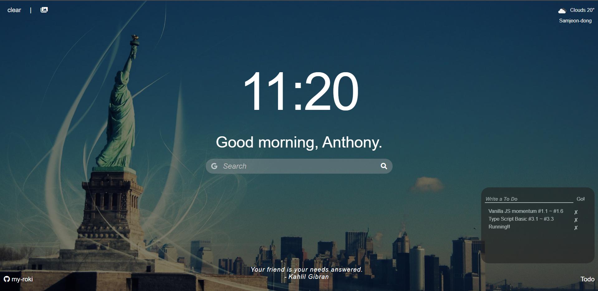

# Chrome Momentum Clone

<a href="https://my-roki.github.io/momentum-clone/" target="_blank">github.io page</a>

### What I Learned.

- [x] Greeting.
- [x] Login function using local storage.
- [x] To-do list
- [x] JS Clocks.
- [x] Random Background Images.
- [x] Random quotes.
- [x] Weather and location(geolocation).

### What I Updated.

- [x] Change background image randomly.
- [x] User reset(clear, logout).
- [x] Add weather icon.
- [x] Searching Form
- [x] Update to-do list using modal(aside) pop up page.

### What I Should Do.

- [] Dynamic Web Page.
- [] Check-box and underline when to-do list done.
- [] Update,edit to-do list.
- [] Music player.
- [] Add Various searching engine page.
- [] Enable to costomize backgroung image(ex. upload image, only one color...).

Copyright

<a href="https://nomadcoders.co/javascript-for-beginners" target="_blank">
NomadCoder - VanilaJS 크롬앱 만들기
</a>
